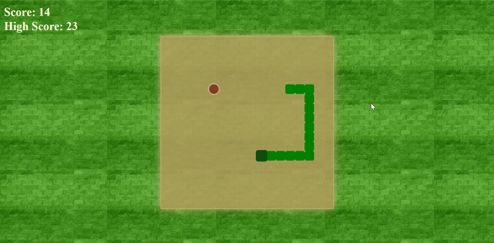

# 🎮 Snake Game – HTML, CSS & JavaScript

A simple, classic Snake game built using **HTML**, **CSS**, and **JavaScript**. Play the game in your browser, control the snake using arrow keys, eat food to grow, and avoid hitting the wall or yourself!

## 🕹️ Features

- Smooth snake movement with arrow key controls
- Randomly placed food to grow your snake
- Self-collision and wall-collision detection
- Score tracking
- Game-over and restart functionality
- Clean and responsive UI using vanilla HTML, CSS, and JS

## 🚀 Live Demo

[Click here to play the game](https://akanksha312kumari.github.io/Snake-game/)  

## 📂 Project Structure
- index.html # Main HTML structure
- style.css # Styling for the game layout
- script.js # Game logic using JavaScript


## 🛠️ How to Run Locally

1. Clone this repository:
   ```bash
   git clone https://github.com/your-username/snake-game.git

2. Navigate to the project directory
    cd snake-game

3. Open index.html in your browser:
- Simply double-click the file
- Or use a live server if you have VS Code installed

## 👩‍💻 Skills Used

- 🧱 **HTML5** – for structuring the game layout
- 🎨 **CSS3** – for styling the snake, board, and UI
- 🧠 **JavaScript** – for implementing game logic, movement, collision detection, and DOM updates

## 📸 Screenshot


